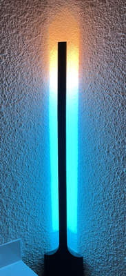

# ESPHome based accessories for home automation

Install ESPHome from https://esphome.io/guides/getting_started_command_line.html
On Mac, you can't use the docker method indicated there, as there is no USB device access for docker.

Install pip on the mac in some other way. Some notes https://ahmadawais.com/install-pip-macos-os-x-python

## Usage
Use ESPHome normally. I find that running the integrated dashboard works really well for uploading.
Edit in a regular editor and click upload on the dashboard or just use the dashboard

```bash
esphome . dashboard
```
## Setup

Create a file `common/secrets.yaml` with the following

```
  substitutions:
    api_password: some_api_password
    wifi_ssid: "your home wifi"
    wifi_password: "your home wifi password"
    hotspot_password: "some password for fallback wifi"
    memorial_lat: "some latitude"
    memorial_long: "some longitude"
    timezone: "your TZ name"
```

## Accessories

### Candle



After losing our baby boy Herón Nicolás during labor, I wanted to have a small creative project to keep my hands
busy. I made a small light that looks like a candle to help me think about him, and to take
things slow, relax and live life. When the sun sets on his memorial location, the light turns on automatically.

This light has a single LED strip split into 2 logical segments. The full light is hidden from the API but each
segment is controllable.

The last 3 LEDs make the 'fire' section of the candle and have a flicker effect automatically applied to it when it's turned on.
The 'stick' or body section of the candle is controllable too.

There is a push button with a pull down resistor on pin `GPIO13` that will switch the full length of the string on and off.

### Infinity Eclipse
A small experiment for an infinity  mirror. Functionally it's just a regular neopixel on a ESP8266 nodemcu light the
same as all above.

The push button on `GPIO13` with a pull down resistor uses the same code as the candle light.

### Random notes

Run this to start the pi-hole docker next to the homebridge docker

```
docker volume create dnsmasq

docker volume create pihole
docker run -d \
  --name=pihole\
  -e VIRTUAL_HOST=pi.hole\
  -e PROXY_LOCATION=pi.hole\
  --hostname pi.hole\
  -p 80:80 -p 443:443 -p 53:53/tcp -p 53:53/udp\
  --cap-add=NET_ADMIN\
  --restart=unless-stopped\
  -v pihole:/etc/pihole\
  -v dnsmasq:/etc/dnsmasq.d\
  -e TZ="America/Los_Angeles"\
  -e ServerIP="192.168.1.5"\
  --dns=127.0.0.1 --dns=1.1.1.2\
  pihole/pihole:latest
```

Run this to start the homebridge server docker in the raspberry pi

```
  docker volume create homebridge
  docker run -d \
  --name=homebridge\
  --restart=always\
  -e HOMEBRIDGE_CONFIG_UI=1 \
  -e HOMEBRIDGE_CONFIG_UI_PORT=8080 \
  -v homebridge:/homebridge \
  -p 8080:8080 -p 52689:52689 \
  oznu/homebridge
```